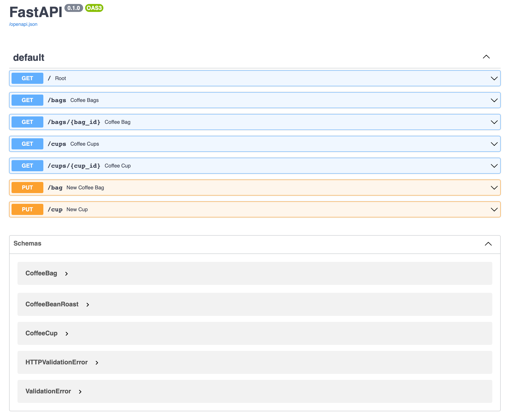
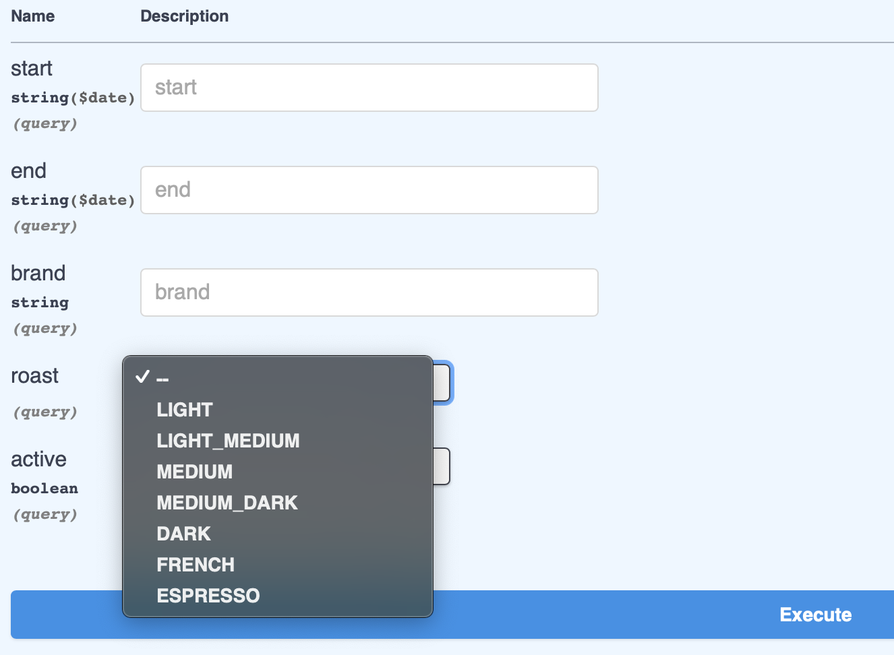
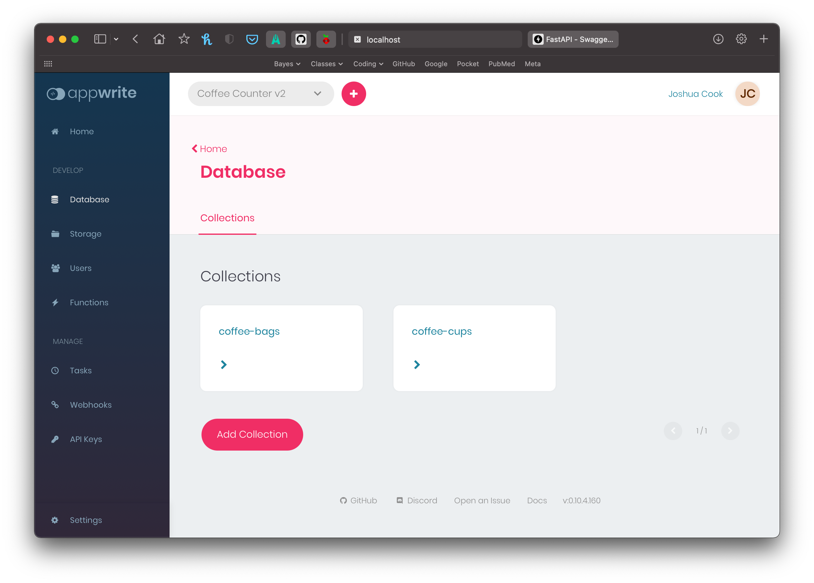
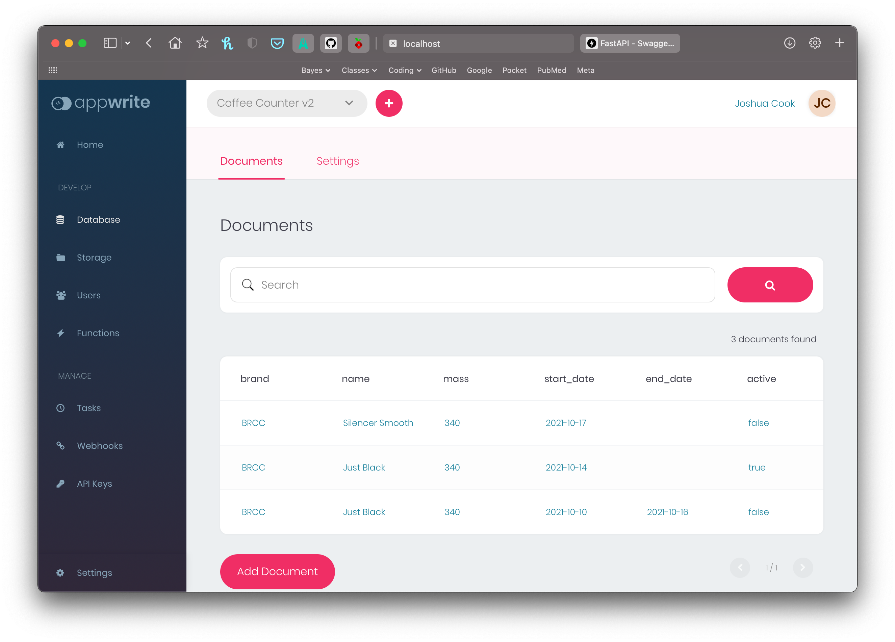
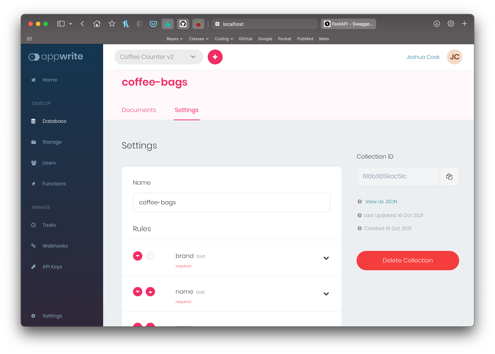

# Coffee Counter API with Appwrite backend database demo

[](https://www.python.org)
[](https://fastapi.tiangolo.com)
[](https://github.com/pre-commit/pre-commit)
[](https://github.com/psf/black) <br>
<a href="https://appwrite.io/" target="_blank">
  
</a>

This repo serves as a demonstration of using [Appwrite's](https://appwrite.io) Database services in a Python application.
The demo would be part of an app that tracks coffee consumption.
The API is written with [FastAPI](https://fastapi.tiangolo.com) with data validation by [pydantic](https://pydantic-docs.helpmanual.io).

My current working version of this app (not using Appwrite, at the moment) can be found [here](https://github.com/jhrcook/coffee-counter-api).

### Run the app

First, you'll need to set up Appwrite.
This is a very easy process to do either locally or on a cloud service such as Linode or DigitalOcean.
See Appwrite's [docs](https://appwrite.io/docs/installation) for how to install locally or my tutorial on [how to get Appwrite up-and-running on DigitalOcean](https://joshuacook.netlify.app/post/appwrite-digital-ocean/).
Once this is set, create a new Project and add the two Collections described below.
Replace the current IDs in the [configuration](config.yaml) file.

With Appwrite setup, you can run this project using the following commands.

```bash
# Setup python env and install dependencies
python -m venv .env
source .env/bin/activate
pip install --upgrade pip && pip install -r requirements.txt

# Start the app.
uvicorn main:app --reload
```

Then go to [http://127.0.0.1:8000/docs](http://127.0.0.1:8000/docs) in your browser.

---

## Description

The overall point of this app is to serve as a method for tracking my coffee consumption.
I want more than just the number of cups, but also the coffee bag that was used and the lifetime of the coffee bags.
You can read more about the purpose and the various tools I have built around the API on my [website](https://joshuacook.netlify.app/project/coffee-counting/).

Below, I try to describe the various pieces of the demo.
I begin by detailing the data models followed by the API endpoints and main features of the demo app.
Next, I describe how to use Appwrite's [Python SDK](https://github.com/appwrite/sdk-for-python) to read and write data to the Appwrite database.
Finally, I cover how I used pydantic to act as a data validation layer between the result of a database query and the main code.

### Data models

The main data models for this app are the `CoffeeBag` and `CoffeeCup` defined in ["models.py"](models.py).
A coffee bag has a brand, name, mass, start and end date, roast (e.g. light, medium, dark), and indication of if it is "active" (i.e. in use).
A coffee cup just has a datetime attribute to indicate when it was made and a `bag_id` to link it to a coffee bag.
One change that could be made would be to embed the coffee cups into an array attribute of the coffee bag, but for this demonstration, I decided to keep them separate for simplicity's sake.
If I were to further develop this into a full app, I would likely make this change to help with organization as the app grows in complexity.

```python
class CoffeeBag(BaseModel):
    """Coffee bag data."""
    brand: str
    name: str
    mass: PositiveFloat
    start_date: Optional[date] = None
    end_date: Optional[date] = None
    active: bool
    roast: Optional[CoffeeBeanRoast] = None

class CoffeeCup(BaseModel):
    """Coffee cup data."""
    bag_id: str
    datetime: datetime
```

### API features

Since this is just a demo, I focused on the main features and API endpoints.
Also, I ignored the rough edges of managing datetimes (e.g. time zones and location).
For this demo, I have `GET` endpoints for getting all coffee bags, a specific coffee bag (by its ID), all cups of coffee, and a specific cup of coffee (by its ID).
There are also `PUT` endpoints for adding a bag of coffee and a new cup of coffee.



One of the nice features of the FastAPI's use of typehints is the increased details in the docuemntation.
For instance, in the `bags/` endpoint, there are various filter options, one of which is by the roast of the beans:

```python
@app.get("/bags")
def coffee_bags(
    start: Optional[date] = None,
    end: Optional[date] = None,
    brand: Optional[str] = None,
    roast: Optional[CoffeeBeanRoast] = None,
    active: Optional[bool] = None,
) -> list[CoffeeBagDocument]:
	...
```

Because the roast is defined as an enumeration, the documentation automatically shows the available options:



### Appwrite database interactions through the Python SDK

It is possible to interact with the Appwrite server through a [web API](https://appwrite.io/docs) or their [Python SDK](https://github.com/appwrite/sdk-for-python).
For this demonstration, I used the Python SDK, though I think it is still a bit of a work-in-progress.
The documentation for the Appwrite Database is available [here](https://appwrite.io/docs/client/database).

The structure of an Appwrite Database is divided into "collections" and "documents" where the former is the table and the latter individual data points or rows in the table.

The first step is to set up the two collections on the server, one for coffee bag and one for cups.
This can be accomplished programmatically through the SDK or web API.
For this size of job, it is easiest to just do it in the Appwrite GUI Console.
The 30 Days of Appwrite post ["Appwrite Database"](https://dev.to/appwrite/30daysofappwrite-appwrite-database-22an) describes how to do this easily.
Below are some screenshots from the console.





The code for interacting with the Appwrite databases is in ["appwrite_backend.py"](appwrite_backend.py).
The general flow is to create a `Client`, use the `Client` to get a `Database`, and then make queries through the `Database`.
A simple example of this is the function to get a specific bag of coffee using its unique ID.
More information on the conversion to data class objects is discussed in the next section.

```python
def get_coffee_bag(id: str) -> CoffeeBagDocument:
    db = _get_database()  # Makes a `Client` and retrieves a `Database` object
    # Get a `document` coffee bag using its ID.
    res = db.get_document(
        collection_id=_get_coffee_bag_collections_id(), document_id=id
    )
    return CoffeeBagDocument(**res)
```

There is also an option to get all documents in a collection.
An example of this is in the retrieval of all the bags of coffee with optional filters.
The filters are individual strings contained in a list and passed in the `filters` parameter of the query.
Note that a boolean value must be converted to an integer (I found this out with a bit of trial-and-error).

```python
def get_coffee_bags(
    brand: Optional[str], active: Optional[bool], roast: Optional[CoffeeBeanRoast]
) -> list[CoffeeBagDocument]:
    db = _get_database()

    filters = []
    if brand is not None:
        filters.append(f"brand={brand}")
    if active is not None:
        filters.append(f"active={int(active)}")
    if roast is not None:
        filters.append(f"roast={roast}")

    print(filters)
    res = db.list_documents(_get_coffee_bag_collections_id(), filters=filters)
    return [CoffeeBagDocument(**info) for info in res["documents"]]
```

### Appwrite `Collections` and `Documents` with pydantic

In this app, I use [pydantic](https://pydantic-docs.helpmanual.io) to act as a data validation and standardization layer between the queries to Appwrite's database and the main code.
The data returned by the functions in ["appwrite_backend.py"](appwrite_backend.py) all return validated data class objects.

Along with the data validation, this also acts as a decoupling layer between the Appwrite-facing code and the main code.
Thus, if there are changes on the Appwrite side, the return values can remain consistent.

I used a "mixin-like" pattern for the pydantic models.
I began with a model that abstracts the object in question such as a coffee bag and the `CoffeeBag` class.
Then, I created an `AppwriteDocument` class that contains the attributes common to all Appwrite Document return types: and ID, collection ID, and permission fields.
To put these all together, I just made a third type `CoffeeBagDocument(CoffeeBag, AppwriteDocument)` that subclassed both of these objects.
That way, I could use a `CoffeeBag` abstraction when appropriate, such as getting a new bag from a user, or a coffee bag Document when needed, such as the return from a database query.

```python
class CoffeeBag(BaseModel):
    """Coffee bag data."""

    brand: str
    name: str
    mass: PositiveFloat
    start_date: Optional[date] = None
    end_date: Optional[date] = None
    active: bool
    roast: Optional[CoffeeBeanRoast] = None

    def __init__(self, **data) -> None:
        for k in ["start_date", "end_date", "roast"]:
            if data.get(k, None) == "":
                data[k] = None
        super().__init__(**data)

class AppwriteDocumentPermissions(BaseModel):
    """Appwrite document permissions."""

    read: list[str]
    write: list[str]

class AppwriteDocument(BaseModel):
    """Basic fields for an Appwrite document."""

    id: str
    collection: str
    permissions: AppwriteDocumentPermissions

    def __init__(self, **kwargs) -> None:
        for k in list(kwargs.keys()):
            if isinstance(k, str):
                _k = re.sub("^\\$", "", k)
                kwargs[_k] = kwargs.pop(k)
        super().__init__(**kwargs)

class CoffeeBagDocument(CoffeeBag, AppwriteDocument):
    """Coffee Bag Document."""
```

The only annoying part of this process is that for missing data in optional fields in an Appwrite document, Appwrite returns an empty string instead of `null`.
This is an issue when pydantic tries to convert `""` into a datetime for `start_date` or `end_date`.
Thus, I have to manually replace these missing values with `None` before pydnatic validation in the constructor of `CoffeeBag`.

Another annoyance is that the keys for the document ID, collection ID, and permission fields in the result of a database query are prepended with `"$"` – e.g. `id` is `$id`.
I cannot represent these as fields in the pydantic model, so again the keys needed to be adjusted before validation in the constructor of `AppwriteDocument`.
